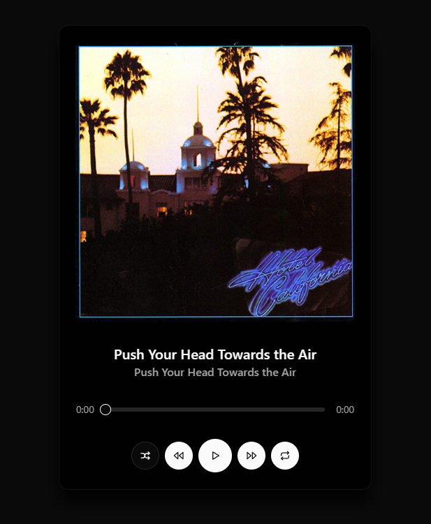

# 🎵 LocalTune

An unfinished project that aims to become a self-hosted music server to save and display your songs and artists, with support for metadata searching. Create your personal music sanctuary with an elegant and intuitive interface.



## 🌟 Features

-   🎼 **Music Library Management**: Organize and browse your music collection
-   🔍 **Metadata Search**: Find songs quickly with smart search capabilities
-   🎨 **Beautiful Interface**: Clean and modern design for the best user experience
-   🎯 **Custom Playlists**: Create and manage your personal playlists
-   📱 **Responsive Design**: Access your music from any device

## 🔧 Prerequisites

-   Node.js 16.0 or higher
-   pnpm package manager
-   Modern web browser

## 🚀 Technologies

-   React + TypeScript
-   Vite
-   Tailwind CSS
-   Node.js
-   Shadcn/ui

## 💻 Installation

1. Clone the repository:

```bash
git clone https://github.com/your-username/LocalTune.git
cd LocalTune
```

2. Install dependencies:

```bash
pnpm install
```

3. Start the development server:

```bash
pnpm dev
```

## 🎮 Usage

1. Launch the application
2. Add your music library
3. Enjoy your personal music collection with rich metadata support
4. Create and manage playlists
5. Control playback with an intuitive interface

## 🤝 Contributing

Contributions are welcome! Feel free to open issues and submit pull requests to help improve LocalTune.

## 📝 License

This project is licensed under the MIT License - see the LICENSE file for details.
